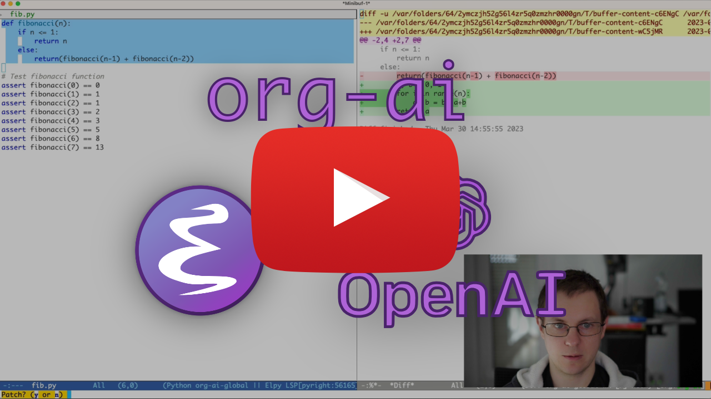
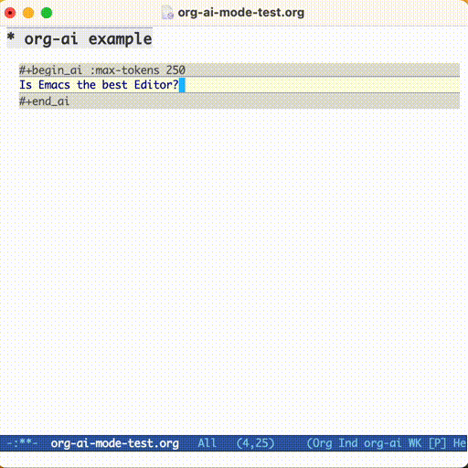
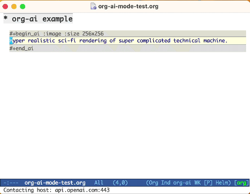
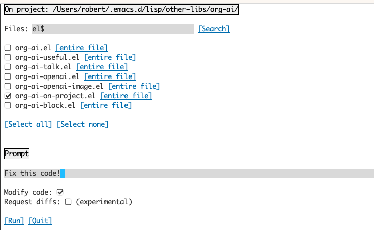

# org-ai [](https://melpa.org/#/org-ai)

[](https://www.youtube.com/watch?v=fvBDxiFPG6I)

Minor mode for Emacs org-mode that provides access to generative AI models. Currently supported are
- OpenAI API (ChatGPT, DALL-E, other text models)
- Stable Diffusion through [stable-diffusion-webui](https://github.com/AUTOMATIC1111/stable-diffusion-webui)

Inside an org-mode buffer you can
- use ChatGPT to generate text, having full control over system and user prompts ([demo](#chatgpt-in-org-mode))
- Speech input and output! Talk with your AI!
- generate images and image variations with a text prompt using Stable Diffusion or DALL-E ([demo 1](#dall-e-in-org-mode), [demo 2](#image-variations))
- org-ai everywhere: Various commands usable outside org-mode for prompting using the selected text or multiple files.

_Note: In order to use the OpenAI API you'll need an [OpenAI account](https://platform.openai.com/) and you need to get an API token. As far as I can tell, the current usage limits for the free tier get you pretty far._

------------------------------

## Table of Contents

- [Demos](#demos)
    - [ChatGPT in org-mode](#chatgpt-in-org-mode)
    - [DALL-E in org-mode](#dall-e-in-org-mode)
    - [Image variations](#image-variations)
- [Features and Usage](#features-and-usage)
    - [`#+begin_ai...#+end_ai` special blocks](#begin_aiend_ai-special-blocks)
        - [Syntax highlighting in ai blocks](#syntax-highlighting-in-ai-blocks)
        - [Block Options](#block-options)
            - [For ChatGPT](#for-chatgpt)
            - [For DALL-E](#for-dall-e)
            - [Other text models](#other-text-models)
    - [Image variation](#image-variation)
    - [Global Commands](#global-commands)
        - [org-ai-on-project](#org-ai-on-project)
    - [Noweb Support](#noweb-support)
- [Installation](#installation)
    - [Melpa](#melpa)
    - [Straight.el](#straightel)
    - [Manual](#manual)
    - [OpenAI API key](#openai-api-key)
    - [Setting up speech input / output](#setting-up-speech-input--output)
        - [Whisper](#whisper)
        - [espeak / greader](#espeak--greader)
    - [Setting up Stable Diffusion](#setting-up-stable-diffusion)
- [FAQ](#faq)

## Demos

### ChatGPT in org-mode

```org
#+begin_ai
Is Emacs the greatest editor?
#+end_ai
```



You can continue to type and press `C-c C-c` to create a conversation. `C-g` will interrupt a running request.


### DALL-E in org-mode

```org
#+begin_ai :image :size 256x256
Hyper realistic sci-fi rendering of super complicated technical machine.
#+end_ai
```



### Image variations


## Features and Usage
### `#+begin_ai...#+end_ai` special blocks

Similar to org-babel, these blocks demarcate input (and for ChatGPT also output) for the AI model. You can use it for AI chat, text completion and text -> image generation. See [options](#block-options) below for more information.

Create a block like

```org
#+begin_ai
Is Emacs the greatest editor?
#+end_ai
```

and press `C-c C-c`. The Chat input will appear inline and once the response is complete, you can enter your reply and so on. See [the demo](#chatgpt-in-org-mode) below. You can press `C-g` while the ai request is running to cancel it.

You can also modify the _system_ prompt and other parameters used. The system prompt is injected before the user's input and "primes" the model to answer in a certain style. For example you can do:

```org
#+begin_ai :max-tokens 250
[SYS]: Act as if you are a powerful medival king.
[ME]: What will you eat today?
#+end_ai
```

This will result in an API payload like

```json
{
  "messages": [
    {
      "role": "system",
      "content": "Act as if you are a powerful medival king."
    },
    {
      "role": "user",
      "content": "What will you eat today?"
    }
  ],
  "model": "gpt-3.5-turbo",
  "stream": true,
  "max_tokens": 250,
  "temperature": 1.2
}
```

For some prompt ideas see for example [Awesome ChatGPT Prompts](https://github.com/f/awesome-chatgpt-prompts).

When generating images using the `:image` flag, images will appear underneath the ai block inline. Images will be stored (together with their prompt) inside `org-ai-image-directory` which defaults to `~/org/org-ai-images/`.

You can also use speech input to transcribe the input. Press `C-c r` for `org-ai-talk-capture-in-org` to start recording. Note that this will require you to setup [speech recognition](#setting-up-speech-input--output) (see below). Speech output can be enabled with `org-ai-talk-output-enable`.

Inside an `#+begin_ai...#+end_ai` you can modify and select the parts of the chat with these commands:
- Press `C-c <backspace>` (`org-ai-kill-region-at-point`) to remove the chat part under point.
- `org-ai-mark-region-at-point` will mark the region at point.
- `org-ai-mark-last-region` will mark the last chat part.

#### Syntax highlighting in ai blocks

To apply syntax highlighted to your `#+begin_ai ...` blocks just add a language major-mode name after `_ai`. E.g. `#+begin_ai markdown`. For markdown in particular, to then also correctly highlight code in in backticks, you can set `(setq markdown-fontify-code-blocks-natively t)`. Thanks @tavisrudd for this trick!

#### Block Options

The `#+begin_ai...#+end_ai` block can take the following options.

##### For ChatGPT
By default, the content of ai blocks are interpreted as messages for ChatGPT. Text following `[ME]:` is associated with the user, text following `[AI]:` is associated as the model's response. Optionally you can start the block with a `[SYS]: <behahvior>` input to prime the model (see `org-ai-default-chat-system-prompt` below).

- `:max-tokens number` - number of maximum tokens to generate (default: nil, use OpenAI's default)
- `:temperature number` - temperature of the model (default: 1)
- `:top-p number` - top_p of the model (default: 1)
- `:frequency-penalty number` - frequency penalty of the model (default: 0)
- `:presence-penalty` - presence penalty of the model (default: 0)
- `:sys-everywhere` - repeat the system prompt for every user message (default: nil)

The following custom variables can be used to configure the chat:

- `org-ai-default-chat-model` (default: `"gpt-3.5-turbo"`)
- `org-ai-default-max-tokens` How long the response should be. Currently cannot exceed 4096. If this value is too small an answer might be cut off (default: nil)
- `org-ai-default-chat-system-prompt` How to "prime" the model. This is a prompt that is injected before the user's input. (default: `"You are a helpful assistant inside Emacs."`)
- `org-ai-default-inject-sys-prompt-for-all-messages` Wether to repeat the system prompt for every user message. Sometimes the model "forgets" how it was primed. This can help remind it. (default: `nil`)

##### For DALL-E

When you add an `:image` option to the ai block, the prompt will be used for image generation.

- `:image` - generate an image instead of text
- `:size` - size of the image to generate (default: 256x256, can be 512x512 or 1024x1024)
- `:n` - the number of images to generate (default: 1)

The following custom variables can be used to configure the image generation:
- `org-ai-image-directory` - where to store the generated images (default: `~/org/org-ai-images/`)

##### For Stable Diffusion

Similar to DALL-E but use

```
#+begin_ai :sd-image
<PROMPT>
#+end_ai
```

You can run img2img by labeling your org-mode image with #+name and
referencing it with :image-ref from your org-ai block.

```
#+begin_ai :sd-image :image-ref label1
forest, Gogh style
#+end_ai
```

M-x org-ai-sd-clip guesses the previous image's prompt on org-mode
by the CLIP interrogator and saves it in the kill ring.

M-x org-ai-sd-deepdanbooru guesses the previous image's prompt on
org-mode by the DeepDanbooru interrogator and saves it in the kill
ring.

##### Other text models

The older completion models can also be prompted by adding the `:completion` option to the ai block.

- `:completion` - instead of using the chatgpt model, use the completion model
- `:model` - which model to use, see https://platform.openai.com/docs/models for a list of models

For the detailed meaning of those parameters see the [OpenAI API documentation](https://platform.openai.com/docs/api-reference/chat).

The following custom variables can be used to configure the text generation:

- `org-ai-default-completion-model` (default: `"text-davinci-003"`)


### Image variation

You can also use an existing image as input to generate more similar looking images. The `org-ai-image-variation` command will prompt for a file path to an image, a size and a count and will then generate as many images and insert links to them inside the current `org-mode` buffer. Images will be stored inside `org-ai-image-directory`. See the [demo](#image-variations) below.

[For more information see the OpenAI documentation](https://platform.openai.com/docs/guides/images/variations). The input image needs to be square and its size needs to be less than 4MB. And you currently need curl available as a command line tool[^1].

[^1]: __Note:__ Currenly the image variation implementation requires a command line curl to be installed. Reason for that is that the OpenAI API expects multipart/form-data requests and the emacs built-in `url-retrieve` does not support that (At least I haven't figured out how). Switching to `request.el` might be a better alternative. If you're interested in contributing, PRs are very welcome!


### Global Commands

`org-ai` can be used outside of `org-mode` buffers as well. When you enable `org-ai-global-mode`, the prefix `C-c M-a` will be bound to a number of commands:

| command                          | keybinding  | description                                                                                                                                                                                                                                                                                                                                                    |
|:---------------------------------|:------------|:---------------------------------------------------------------------------------------------------------------------------------------------------------------------------------------------------------------------------------------------------------------------------------------------------------------------------------------------------------------|
| `org-ai-on-region`               | `C-c M-a r` | Ask a question about the selected text or tell the AI to do something with it. The response will be opened in an org-mode buffer so that you can continue the conversation. Setting the variable `org-ai-on-region-file` (e.g. `(setq org-ai-on-region-file (expand-file-name "org-ai-on-region.org" org-directory))`) will associate a file with that buffer. |
| `org-ai-summarize`               | `C-c M-a s` | Summarize the selected text.                                                                                                                                                                                                                                                                                                                                   |
| `org-ai-refactor-code`           | `C-c M-a c` | Tell the AI how to change the selected code, a diff buffer will appear with the changes.                                                                                                                                                                                                                                                                       |
| `org-ai-on-project`              | `C-c M-a p` | Run prompts and modify / refactor multiple files at once. Will use [projectile](https://github.com/bbatsov/projectile) if available, falls back to the current directory if not.                                                                                                                                                                               |
| `org-ai-prompt`                  | `C-c M-a P` | Prompt the user for a text and then print the AI's response in current buffer.                                                                                                                                                                                                                                                                                 |
| `org-ai-switch-chat-model`       | `C-c M-a m` | Interactively change `org-ai-default-chat-model`                                                                                                                                                                                                                                                                                                               |
| `org-ai-open-account-usage-page` | `C-c M-a $` | Opens https://platform.openai.com/account/usage to see how much money you have burned.                                                                                                                                                                                                                                                                         |
| `org-ai-open-request-buffer`     | `C-c M-a !` | Opens the `url` request buffer. If something doesn't work it can be helpful to take a look.                                                                                                                                                                                                                                                                    |
| `org-ai-talk-input-toggle`       | `C-c M-a t` | Generally enable speech input for the different prompt commands.                                                                                                                                                                                                                                                                                               |
| `org-ai-talk-output-toggle`      | `C-c M-a T` | Generally enable speech output.                                                                                                                                                                                                                                                                                                                                |

#### org-ai-on-project

This is an experimental feature. Running this command will open a separate buffer that allows you to select choose multiple files (and optionally select a sub-region inside a file) and then run a prompt on it.



If you deactivate "modify code", the effect is similar to running `org-ai-on-region` just that the file contents all appear in the prompt.

With "modify code" activated, you can ask the AI to modify or refactor the code. By default ("Request diffs") deactivated, we will prompt to generate the new code for all selected files/regions and you can then see a diff per file and decide to apply it or not. With "Request diffs" active, the AI will be asked to directly create a unified diff that can then be applied. This is experimental and might not work. GPT can't count...

### Noweb Support

Given a named source block
```
#+name: sayhi
#+begin_src shell
echo "Hello there"
#+end_src
```
We can try to reference it by name, but it doesn't work.
```
#+begin_ai
[SYS]: You are a mimic. Whenever I say something, repeat back what I say to you. Say exactly what I said, do not add anything.

[ME]: <<sayhi()>>


[AI]: <<sayhi()>>

[ME]:
#+end_ai
```
With `:noweb yes`

```
#+begin_ai :noweb yes
[SYS]: You are a mimic. Whenever I say something, repeat back what I say to you. Say exactly what I said, do not add anything.

[ME]: <<sayhi()>>


[AI]: Hello there.

[ME]:
#+end_ai
```

You can also trigger noweb expansion with an `org-ai-noweb: yes` heading proprty anywhere in the parent headings (header args takes precedence).

To see what your document will expand to when sent to the api, run `org-ai-expand-block`.

#### Run arbitrary lisp inline

This is a hack but it works really well.

Create a block

```
#+name: identity
#+begin_src emacs-lisp :var x="fill me in"
(format "%s" x)
#+end_src
```

We can invoke it and let noweb parameters (which support lisp) evaluate as code

```
#+begin_ai :noweb yes
Tell me some 3, simple ways to improve this dockerfile

<<identity(x=(quelpa-slurp-file "~/code/ibr-api/Dockerfile"))>>


[AI]: 1. Use a more specific version of Python, such as "python:3.9.6-buster" instead of "python:3.9-buster", to ensure compatibility with future updates.

2. Add a cleanup step after installing poetry to remove any unnecessary files or dependencies, thus reducing the size of the final image.

3. Use multi-stage builds to separate the build environment from the production environment, thus reducing the size of the final image and increasing security. For example, the first stage can be used to install dependencies and build the code, while the second stage can contain only the final artifacts and be used for deployment.

[ME]:
#+end_ai
```


## Installation

### Melpa

org-ai is on Melpa: https://melpa.org/#/org-ai. If you have added Melpa to your package archives with

```elisp
(require 'package)
(add-to-list 'package-archives '("melpa" . "http://melpa.org/packages/") t)
(package-initialize)
```

you can install it with:

```elisp
(use-package org-ai
  :ensure t
  :commands (org-ai-mode
             org-ai-global-mode)
  :init
  (add-hook 'org-mode-hook #'org-ai-mode) ; enable org-ai in org-mode
  (org-ai-global-mode) ; installs global keybindings on C-c M-a
  :config
  (setq org-ai-default-chat-model "gpt-4") ; if you are on the gpt-4 beta:
  (org-ai-install-yasnippets)) ; if you are using yasnippet and want `ai` snippets

```

### Straight.el

```elisp
(straight-use-package
 '(org-ai :type git :host github :repo "rksm/org-ai"
          :local-repo "org-ai"
          :files ("*.el" "README.md" "snippets")))
```

### Manual

Checkout this repository.

```sh
git clone
https://github.com/rksm/org-ai
```

Then, if you use `use-package`:

```elisp
(use-package org-ai
  :load-path (lambda () "path/to/org-ai"))
  ;; ...rest as above...

```

or just with `require`:

```elisp
(add-to-list 'load-path "path/to/org-ai")
(require 'org)
(require 'org-ai)
(add-hook 'org-mode-hook #'org-ai-mode)
(org-ai-global-mode)
(setq org-ai-default-chat-model "gpt-4") ; if you are on the gpt-4 beta:
(org-ai-install-yasnippets) ; if you are using yasnippet and want `ai` snippets
```

### OpenAI API key

You can either directly set your api token in your config:

```elisp
(setq org-ai-openai-api-token "<ENTER YOUR API TOKEN HERE>")

```

Alternatively, `org-ai` supports `auth-source` for retrieving your API key. You can store a secret in the format

```
machine api.openai.com login org-ai password <your-api-key>
```

in your `~/authinfo.gpg` file. If this is present, org-ai will use this mechanism to retrieve the token when a request is made. If you do not want `org-ai` to try to retrieve the key from `auth-source`, you can set `org-ai-use-auth-source` to `nil` before loading `org-ai`.

### Setting up speech input / output

#### Whisper

These setup steps are optional. If you don't want to use speech input / output, you can skip this section.

_Note: My personal config for org-ai can be found in [this gist](https://gist.github.com/rksm/04be012be07671cd5e1dc6ec5b077e34). It contains a working whisper setup._

This has been tested on macOS and Linux. Someone with a Windows computer, please test this and let me know what needs to be done to make it work (Thank You!).

The speech input uses [whisper.el](https://github.com/natrys/whisper.el) and `ffmpeg`. You need to clone the repo directly or use [straight.el](https://github.com/radian-software/straight.el) to install it.

1. install ffmpeg (e.g. `brew install ffmpeg` on macOS) or `sudo apt install ffmpeg` on Linux.
2. Clone whisper.el: `git clone https://github.com/natrys/whisper.el path/to/whisper.el`

You should now be able to load it inside Emacs:

```elisp
(use-package whisper
  :load-path "path/to/whisper.el"
  :bind ("M-s-r" . whisper-run))
```

Now also load:

```elisp
(use-package greader :ensure)
(require 'whisper)
(require 'org-ai-talk)

;; macOS speech settings, optional
(setq org-ai-talk-say-words-per-minute 210)
(setq org-ai-talk-say-voice "Karen")
```

##### macOS specific steps

On macOS you will need to do two more things:
1. Allow Emacs to record audio
2. Tell whisper.el what microphone to use

###### 1. Allow Emacs to record audio
You can use the [tccutil helper](https://github.com/DocSystem/tccutil):

```sh
git clone https://github.com/DocSystem/tccutil
cd tccutil
sudo python ./tccutil.py -p /Applications/Emacs.app -e --microphone
```

When you now run `ffmpeg -f avfoundation -i :0 output.mp3` from within an Emacs shell, there should be no `abort trap: 6` error.

###### 2. Tell whisper.el what microphone to use

You can use the output of `ffmpeg -f avfoundation -list_devices true -i ""` to list the audio input devices and then tell whisper.el about it: `(setq whisper--ffmpeg-input-device ":0")`. `:0` is the microphone index, see the output of the command above to use another one.

I've created an emacs helper that let's you select the microphone interactively. See [this gist](https://gist.github.com/rksm/04be012be07671cd5e1dc6ec5b077e34#file-init-org-ai-el-L6).

My full speech enabled config then looks like:

```elisp
(use-package whisper
  :load-path (lambda () (expand-file-name "lisp/other-libs/whisper.el" user-emacs-directory))
  :config
  (setq whisper-model "base"
        whisper-language "en"
        whisper-translate nil)
  (when *is-a-mac*
    (rk/select-default-audio-device "Macbook Pro Microphone")
    (when rk/default-audio-device)
    (setq whisper--ffmpeg-input-device (format ":%s" rk/default-audio-device))))
```

###### Alternative: Siri dictation

On macOS, instead of whisper, you can also use the built-in Siri dictation. To enable that, go to `Preferences -> Keyboard -> Dictation`, enable it and set up a shortcut. The default is ctrl-ctrl.

#### espeak / greader

Speech output on non-macOS systems defaults to using the [greader](http://elpa.gnu.org/packages/greader.html) package which uses [espeak](https://espeak.sourceforge.net/) underneath to synthesize speech. You will need to install greader manually (e.g. via `M-x package-install`). From that point on it should "just work". You can test it by selecting some text and calling `M-x org-ai-talk-read-region`.

### Setting up Stable Diffusion

An API for Stable Diffusion can be hosted with the [stable-diffusion-webui](https://github.com/AUTOMATIC1111/stable-diffusion-webui) project. Go through the [install steps for your platform](https://github.com/AUTOMATIC1111/stable-diffusion-webui#installation-and-running), then start an API-only server:

```sh
cd path/to/stable-diffusion-webui
./webui.sh --nowebui
```

This will start a server on http://127.0.0.1:7861 by default. In order to use it with org-ai, you need to set `org-ai-sd-endpoint-base`:

```elisp
(setq org-ai-sd-endpoint-base "http://localhost:7861/sdapi/v1/")
```

If you use a server hosted elsewhere, change that URL accordingly.

## FAQ

### Is this OpenAI specfic?

Currently yes but once there are more high-quality APIs available I'm planning on supporting those as well.

### Are there similar projects around?

Yes, the gptel package provides similar functionalities: https://github.com/karthink/gptel
